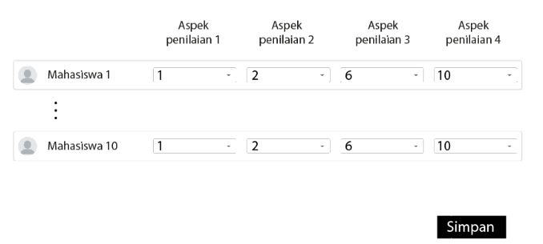

# Grading Mahasiswa 


## Description

This application written using reactjs with vite as builder and vitest as test library.
this application can receive input from user and make output json output below:
```
{
    aspek_penilaian_1: {
        mahasiswa_1: 1,
        ...
        mahasiswa_10: 1,
    },
    ...
    aspek_penilaian_4: {
        mahasiswa_1: 1,
        ...
        mahasiswa_10: 1,
    },
}
```

This project written using tdd approach to make sure app quality


## How to run application ?

Run test
> npm run test //yarn run test if you use yarn

Run app
> npm run dev //yarn run dev if you use yarn
